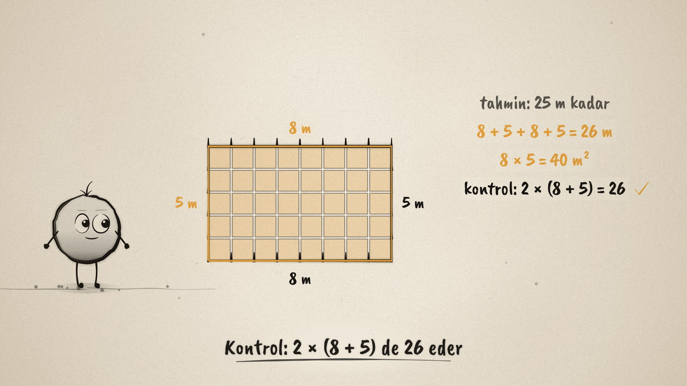
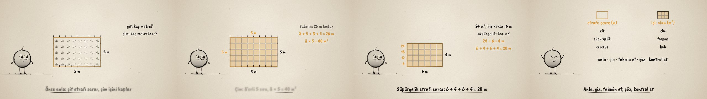

# Çit mi, Çim mi? · Fence or Grass?

**▶ Tarayıcıda izleyin / Watch in the browser:** https://hakanatas.github.io/cit-mi-cim-mi/ 
**⬇ MP4 + altyazılar / MP4 + subtitles:** [Releases](https://github.com/hakanatas/cit-mi-cim-mi/releases) 
**✎ Kullanılan istem / The prompt behind it:** [PROMPT.md](PROMPT.md) 
**🎞 Bütün filmler / All films:** [Nokta'nın Filmleri](https://hakanatas.github.io/nokta-filmleri/)

> **TR —** 5. sınıf matematik "Geometrik Nicelikler" temasındaki MAT.5.4.4 öğrenme çıktısı için hazırlanmış, tamamen JavaScript ile çizilen 92 saniyelik mürekkep animasyonu. Nokta'nın 8 m × 5 m'lik bahçesinin etrafına çit çekilecek, içine çim ekilecek. Önce problem anlaşılıyor: çit etrafı sarar (çevre), çim içini kaplar (alan). Sonra tahmin ediliyor (25 m kadar), çözülüyor (8 + 5 + 8 + 5 = 26 m; 8 × 5 = 40 m²) ve başka bir yolla kontrol ediliyor (2 × (8 + 5) = 26). İkinci problemde Nokta fayans ustası: tabanı 24 m², bir kenarı 6 m olan odaya fayanslar 6'şar diziliyor, 4 sıra oluyor; süpürgelik 6 + 4 + 6 + 4 = 20 m, kontrol 6 × 4 = 24. Film, stratejinin başka problemlere genellenmesiyle bitiyor: etrafı soruluyorsa çevre (çit, süpürgelik, çerçeve), içi soruluyorsa alan (çim, fayans, halı); anla · çiz · tahmin et · çöz · kontrol et. Altyazılar Türkçe, İngilizce ya da ikisi birlikte seçilebilir.

A 92-second ink animation for **5th-grade maths**, drawn entirely with JavaScript on an HTML5 canvas. It is the fourth and last film of the *Geometrik Nicelikler* theme, after [Aynı Çevre](https://github.com/hakanatas/ayni-cevre), [Birim Kareler](https://github.com/hakanatas/birim-kareler) and [Çevre mi, Alan mı?](https://github.com/hakanatas/cevre-mi-alan-mi). Nokta, the ink character from [The Learning Ink](https://github.com/hakanatas/the-learning-ink), is the guide again.

## Learning outcome

MEB, Türkiye Yüzyılı Maarif Modeli, Ortaokul Matematik, 5th grade, "Geometrik Nicelikler" theme:

**MAT.5.4.4. Dikdörtgenin çevre uzunluğu ve alanı ile ilgili problemleri çözebilme**

The sub-items (a–h) follow the problem-solving cycle: identify the mathematical components of the problem and the relations between them, turn the context into other representations and explain it in one's own words, estimate the result, apply a strategy, check the solution and change a strategy that does not work, review the strategies used, generalise them to other problems, and test the generalisation with examples. The program suggests everyday contexts and role play, such as a floor tiler.

| Film moment | Sub-items |
|---|---|
| What is asked? Fence goes around (perimeter), grass covers the inside (area); the garden is drawn with posts and grass tufts | a, b, c, ç |
| Guess about 25 m, then solve: 26 m and 40 m² | d, e |
| Check another way: 2 × (8 + 5) = 26; 6 × 4 = 24 | f |
| Tiler: the unknown side is found by laying tiles 6 per row (a strategy), then shortened to 24 ÷ 6 = 4 | e, g |
| Around it → perimeter (fence, skirting, frame); inside it → area (grass, tiles, carpet) | ğ, h |

## Scenes

| # | Time | Scene | What happens |
|---|---|---|---|
| 1 | 0–10 s | Bahçe | Nokta draws an 8 m × 5 m garden. |
| 2 | 10–26 s | Anla | Two questions: how many metres of fence, how many m² of grass? Fence posts go around, grass sprouts inside. Fence → perimeter, grass → area. |
| 3 | 26–46 s | Tahmin et, çöz, kontrol et | Guess about 25 m. A rope goes around: 8 + 5 + 8 + 5 = 26 m. Unit squares fill the garden row by row: 8 × 5 = 40 m². Check: 2 × (8 + 5) = 26. |
| 4 | 46–68 s | Fayans ustası | A floor of 24 m² with one side 6 m. Tiles go 6 per row: 6, 12, 18, 24, so 4 rows; 24 ÷ 6 = 4 m. Skirting board: 6 + 4 + 6 + 4 = 20 m. Check: 6 × 4 = 24. |
| 5 | 68–80 s | Genelle | Around it: perimeter (fence, skirting, frame). Inside it: area (grass, tiles, carpet). Steps: understand, draw, guess, solve, check. |
| 6 | 80–92 s | Aklında kalsın | "Her problemde önce ne sorulduğunu anla." Nokta celebrates. |

## Running it

- **Preview:** double-click `index.html` (it works offline).
- **MP4:** run `npm install` once, then `npm run export -- --format=horizontal --captions=tr`.
- **Subtitles and narration:** `npm run srt` writes `out/captions_*.srt` and `narration_notes.txt`.
- **Editing:**
  - Caption text, timings and narration notes: `captions.js`
  - Everything on screen is drawn by `LI.world(t)` in `scenes/scene1.js` (garden, room, work lines, rules); the other scenes only set the camera.
  - Fence posts, grass tufts, unit squares, the rope and Nokta's poses: `src/draw/film.js`; layout for 16:9 and 9:16: `src/draw/kd.js`

It uses the same engine as The Learning Ink: `renderFrame(t)` as a pure function of time, seeded randomness, and frame-by-frame export.

## Lisans · License

**TR —** Bu film ve kodu [Creative Commons Atıf-GayriTicari 4.0 Uluslararası (CC BY-NC 4.0)](https://creativecommons.org/licenses/by-nc/4.0/deed.tr) lisansıyla paylaşılır. Ticari olmayan her amaçla (derste, okulda, eğitim materyalinde) kopyalayabilir, paylaşabilir ve değiştirebilirsiniz; ancak **kaynak göstermek zorunludur**: eser sahibinin adı ve bu deponun bağlantısı belirtilmeden kullanılamaz. Ticari kullanım (satış, ücretli ürün ya da yayın) için izin alınmalıdır.

**EN —** This film and its code are licensed under [Creative Commons Attribution-NonCommercial 4.0 International (CC BY-NC 4.0)](https://creativecommons.org/licenses/by-nc/4.0/). You may copy, share and adapt them for non-commercial purposes, but **attribution is required**: they may not be used without crediting the author and linking to this repository. Commercial use requires permission.

Atıf örneği / Required credit: *“Çit mi, Çim mi?”, Hakan Ataş, Nokta'nın Filmleri — https://github.com/hakanatas/cit-mi-cim-mi — CC BY-NC 4.0*
